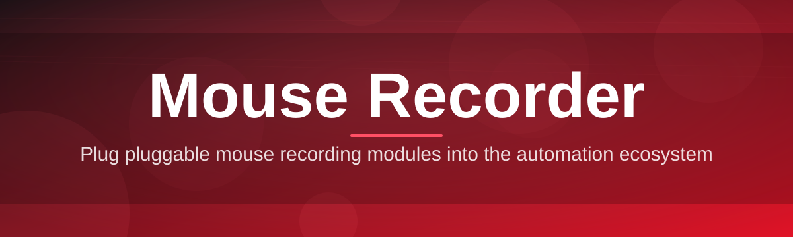
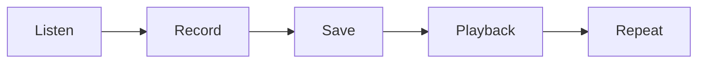

# mouse-recorder-utility 🖱️⚙️

  

*Record once. Play forever. Precision cursor automation for Windows.*

## 🔍 Overview

Repetitive cursor work drains attention that should go toward actual thinking. Every click-drag-click-wait sequence you repeat by hand is a sequence a computer could reproduce with more consistency than your wrist ever will.

**mouse-recorder-utility** captures raw pointer input — movement, clicks, scroll wheel events, timing gaps — and turns it into a replayable script. No macro language to learn, no code to write. You move the mouse the way you normally would, the recorder listens, and the playback engine reproduces that exact path down to the millisecond.

It's built for QA engineers running the same UI flow a hundred times a day, for data-entry teams stuck on legacy software with no API, for streamers automating overlay toggles, and for anyone who has ever thought "I just did this same thing five times in a row." The tool stays out of your way: a small floating panel, a hotkey to start, a hotkey to stop, a file on disk holding the recording.

  

---

## 🧩 What It Actually Does

- **Pixel-accurate path capture** — every recorded movement stores real screen coordinates, not interpolated guesses, so playback lands exactly where you clicked.

- **Timing-faithful playback** — pauses between actions are preserved by default, because a mouse recorder that ignores timing is just a click simulator wearing a costume.

- **Multi-recording library** — save distinct sequences for distinct tasks and switch between them from a dropdown instead of re-recording every session.

- **Loop and repeat controls** — set a recording to run once, a fixed number of times, or indefinitely until you hit the stop hotkey.

- **Adjustable playback speed** — slow a sequence down for fragile UI, or speed it up when timing precision isn't the bottleneck.

- **Global hotkeys** — start, stop, pause, and cancel work system-wide, even when the target window doesn't have focus.

- **Lightweight footprint** — a single executable, no background services, no telemetry phoning home.

- **Portable recordings** — exported files are plain and small enough to share across machines without a database or cloud account.

> [!TIP]
> Name your recordings after the workflow they solve, not the date you made them. "invoice-export" ages better than "recording3."

---

## 🚀 How To Get Started

1. **Visit the landing page** using the download button above.

2. **Download the executable** — a single `.exe`, no installer wizard, no bundled extras.

3. **Run it directly** — Windows may show a SmartScreen prompt for unsigned software; choose "Run anyway."

4. **Press the record hotkey**, perform your mouse actions, press stop — your sequence is ready to replay.

> [!NOTE]
> First launch may take a few seconds while Windows Defender scans the binary. This is normal for unsigned utilities and only happens once.

---

## 🖥️ System Requirements

| Component | Requirement |
|---|---|
| OS | Windows 10 (64-bit) or Windows 11 |
| Dependencies | None — fully standalone |
| Disk space | Under 50 MB |
| Permissions | Standard user; admin only needed for elevated target apps |
| Internet | Not required after download |

  

---

## ⚙️ How It Works

The engine is deliberately simple — three moving parts, no hidden magic.

1. **Input listener** hooks into the OS-level mouse events and timestamps each one as it fires.

2. **Recorder** buffers those timestamped events into an ordered sequence in memory.

3. **Serializer** writes the sequence to a lightweight recording file when you stop.

4. **Playback engine** reads that file back and dispatches synthetic mouse events on the same timeline.

5. **Loop controller** decides whether to stop, repeat, or hand control back to you.

> [!IMPORTANT]
> Recordings are tied to screen coordinates. If you change display resolution or monitor arrangement between recording and playback, positions will drift.

---

## 🩹 Troubleshooting

<strong>Playback clicks land in the wrong place</strong>

Your screen resolution or scaling changed since the recording was made. Re-record at your current resolution, or lock scaling to 100% before capturing.

<strong>The recorder won't capture clicks inside a specific app</strong>

Some applications run with elevated permissions and block input from non-elevated processes. Run mouse-recorder-utility as administrator to match that privilege level.

<strong>Hotkeys stop responding after a while</strong>

Another application may have registered a conflicting global hotkey. Change the recorder's hotkey bindings in Settings to something unused, like F9/F10.

<strong>Windows flags the executable on download</strong>

This is standard SmartScreen behavior for unsigned independent tools. The binary is not code-signed by a paid certificate authority, which triggers the warning regardless of actual safety.

<strong>A recording plays back slightly faster than it was recorded</strong>

Check the playback speed multiplier in the control panel — it may have been left above 1.0x from a previous session.

> [!WARNING]
> Always test a new recording on a non-destructive target first. A misplaced click during an unattended playback can submit forms, delete files, or trigger actions you didn't intend.

---

## 🎨 UI / UX Details

| Action | Default Shortcut |
|---|---|
| Start recording | `Ctrl+F9` |
| Stop recording | `Ctrl+F10` |
| Pause / Resume | `Ctrl+F11` |
| Cancel playback | `Esc` |
| Open recordings library | `Ctrl+L` |

- **Themes** — Light and Dark, switchable instantly from Settings, no restart required.

- **Floating overlay** — a compact status panel shows recording state and elapsed time without stealing window focus.

- **Recording list panel** — thumbnails and durations at a glance, sortable by name or date.

- **Speed slider** — drag to adjust playback rate from 0.25x to 4x in real time.

> [!TIP]
> Dark theme plus the floating overlay's low-opacity mode is the least distracting setup for long unattended playback sessions.

---

## 🤝 Contributing & Community

Bug reports, feature requests, and pull requests are welcome. If you're proposing a new capability, open an issue first so the direction can be discussed before code is written.

- Keep pull requests focused — one change, one purpose.

- Include reproduction steps for any bug fix.

- Follow existing code style; consistency matters more than personal preference here.

> Community discussion, roadmap notes, and release history live in the repository's Issues and Discussions tabs.

---

## 📜 License

Released under the [MIT License](LICENSE), 2026.

---

## ⚠️ Disclaimer

mouse-recorder-utility is provided "as is," for personal productivity and testing purposes. You are responsible for how and where you use recorded automation — including compliance with any third-party software's terms of service. The maintainers assume no liability for misuse or unintended consequences of automated input.

  

